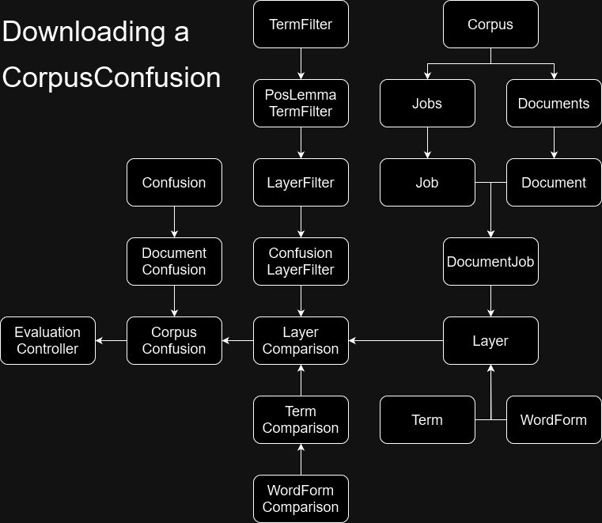

# Dev info
When debugging locally, add "profile=dev" to the environment variables (e.g. in the intelliJ debug configuration).
This makes it so that:
- taggers are called on localhost, instead of their docker container name via a docker network
- we use a test user, instead of retrieving it from the request headers

# Source code
The src/ folder contains the following packages:

## app
The base for spring boot and some application wide interfaces.

## data
All Galahad data is stored on disk. Hence why we have classes here like FileBackedCache and FileBackedValue.

## data.corpus

## data.layer
The annotations in a document (i.e. lemma and pos of each token) are collectively called a layer. A document can have multiple layers (as it can be tagged by multiple taggers). The original annotation layer is called the "sourceLayer".
A layer consists of a list of terms. A term consists of a lemma, a part of speech, and a token. At some point, the system was designed for a term to be able to point to multiple token, hence why Term in reality has a list of tokens, called "word forms". But in reality there is only ever one token, and multi word terms were not fully developed.

## evaluation
For evaluating a single layer (the frequency distribution) or comparing two layers (part of speech confusion and accuracy metrics), where one represents the absolute truth (called the "reference") and one is being tested against it (called the "hypothesis"). The main use case is setting the sourceLayer as the absolute truth reference.

The subpackages confusion, distribution, and metrics calculate their respective evaluations in a similar manner.
E.g. for distribution: There is a CorpusDistribution, which calls a DocumentDistribution on each document in the corpus.
Both types inherit from the same aggregation class. Within each document, term are aggregated into a single object. And within the corpus, documents are aggregated into a single object.

### evaluation.comparison
To perform the evaluation, we compare layers (LayerComparison), which requires us to compare the terms (TermComparison), which requires us to compare the word forms (WordFormComparions). The part of speech confusion and accuracy metrics then use these comparisons to construct an evaluation. They also keep track of 10 random samples for each evaluation. For example, for the %-incorrect metric of lemmata, 10 random samples are chosen that show a term with an incorrect lemma. And, for example, for the part of speech confusion, 10 samples are chosen to demonstrate the evaluation "noun vs verb". Etc.

Both evaluation.metrics and evaluation.comparison group on some annotation (e.g. pos). You can filter this even further

### evaluation.metrics
The metrics calculation does in part use the same aggregation as described above, but adds more complexity in order to keep track of false positives, false negatives, etc.; micro and macro metrics; grouped metrics and global metrics; and all of this grouped by various annotations (lemma, pos, etc.) and filtered by various criteria (e.g. multi pos only, like ADP+NOU).

CorpusMetrics and DocumentMetrics exist and inherit from Metrics. Because of the group and filter option, we need to define these settings somewhere: MetricsSettings.

Using MetricsSettings, you can create a MetricsType, which calculates metrics according to the settings. The Metrics base class, then, calculates a list of different MetricsTypes all at the same time.

These MetricsTypes have global information: micro, macro, classification classes (true positive, etc.). And they have grouped information (e.g. grouped by pos: NOU, ADV, etc.): micro and classification classes. 

The global information is calculated based on the grouped information at the time of json serialization (at that point, all terms in the corpus have been seen).

### evaluation.assays
In order to show a leaderboard of taggers on datasets, we have so-called 'assays'. These are simplified accuracy metrics.

## jobs
The process of a tagger tagging a document, which creates a new annotation layer, is called a job.

## port
Contains all document readers, converters and mergers for the supported formats in Galahad.

## tagset & tagger
Both relatively simple packages. Read out yaml files in a folder and make them available in a singleton-like manner.